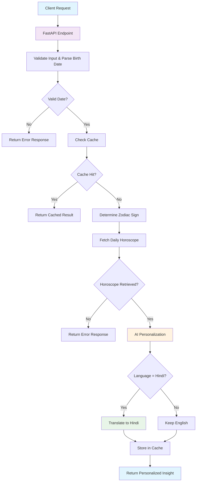

# Astro Insights Service

A FastAPI-based service that generates personalized astrological insights using AI models. The service combines zodiac sign determination, daily horoscope fetching, and AI-powered personalization to deliver customized horoscope content in multiple languages.

## Features

- **Zodiac Sign Detection**: Automatically determines zodiac sign from birth date
- **Daily Horoscope Fetching**: Retrieves fresh horoscope content from external sources
- **AI Personalization**: Uses advanced language models (TinyLlama, GPT-2) for personalization
- **Multi-language Support**: Supports English and Hindi responses
- **Intelligent Caching**: Caches personalized horoscopes for improved performance
- **Health Monitoring**: Provides health check endpoints for monitoring

## Quick Start

### Prerequisites
- Python 3.8+
- pip

### Installation
```bash
# Install dependencies
pip install -r app/requirements.txt
```

### Running the Application

#### Quick Start (Easiest for Testing)
```bash
# Make boot script executable
chmod +x boot.sh

# Run the application
./boot.sh
```

```bash
gunicorn app.main:app --workers 1 --worker-class uvicorn.workers.UvicornWorker --timeout 120 --bind 0.0.0.0:8000
```

#### Development (Auto-reload)
```bash
uvicorn app.main:app --reload
```

#### Production (with monitoring)
```bash
# Install DataDog tracing (optional)
pip install ddtrace

# Run with boot script
./boot.sh
```

### Access Points
- **API Documentation**: http://localhost:8000/docs
- **Alternative Docs**: http://localhost:8000/redoc
- **Health Check**: http://localhost:8000/v1

## API Endpoints

### Health Check
```bash
GET /v1
HEAD /v1
```

### Generate Insight
```bash
POST /v1/generate-insight
```

**Request Body:**
```json
{
  "name": "John Doe",
  "birth_date": "1995-01-15",
  "birth_time": "10:30 AM",
  "birth_place": "New York, NY",
  "language": "ENGLISH"
}
```

**Response:**
```json
{
  "zodiac": "CAPRICORN",
  "insight": "Hello John, today brings new opportunities...",
  "language": "ENGLISH"
}
```

## Project Structure
```
app/
├── cache/              # Caching implementation
├── client/             # HTTP client for external APIs
├── constants/          # Enums and constants
├── dto/               # Data transfer objects
├── manager/           # Business logic layer
├── model/             # AI model implementations
├── resource/          # API endpoints
└── utils/             # Utility functions
```

## Architecture

### Request Flow Diagram



### Data Flow
1. **Request Processing**: Validates user input and birth date
2. **Cache Check**: Looks for existing personalized horoscope for today
3. **Zodiac Determination**: Calculates zodiac sign from birth date
4. **Horoscope Fetching**: Scrapes daily horoscope from external source
5. **AI Personalization**: Uses LLM models to personalize content
6. **Translation** (if needed): Translates to Hindi using Helsinki-NLP
7. **Caching**: Stores result for future requests
8. **Response**: Returns personalized insight

### Components
- **FastAPI**: Web framework and API documentation
- **Pydantic**: Data validation and serialization
- **Transformers**: AI models for text generation and translation
- **BeautifulSoup**: Web scraping for horoscope content
- **APScheduler**: Background tasks for cache cleanup
- **Threading**: Thread-safe singleton cache implementation
